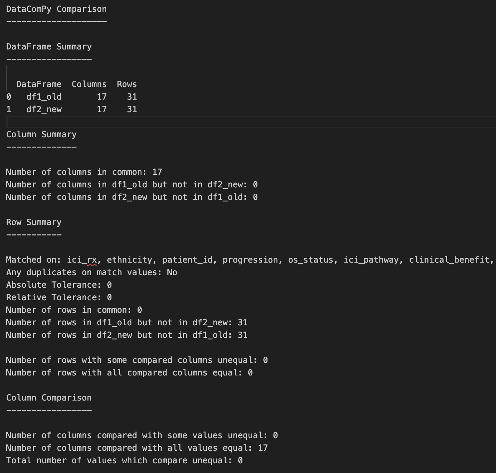
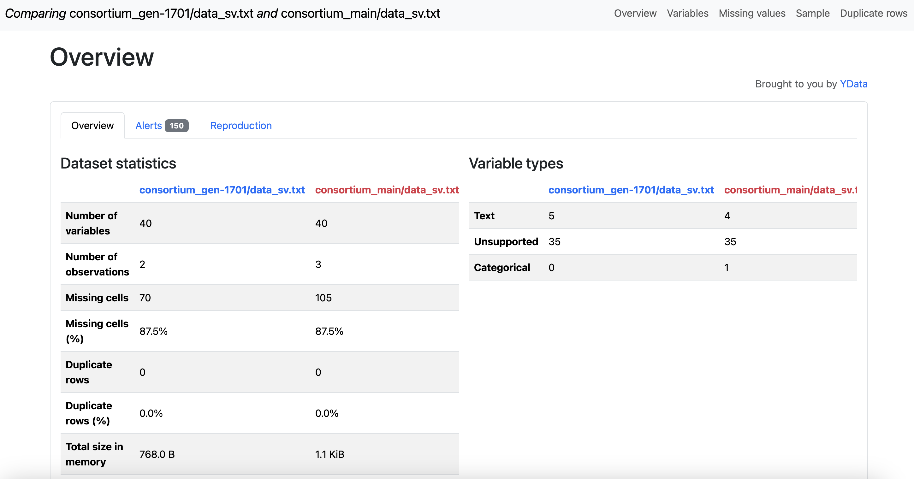

# Synapse Compare

## Table of Contents

- [Purpose](#purpose)
- [Data Requirements](#data-requirements)
  - [Supported Synapse Entities](#supported-synapse-entities)
  - [Supported File Formats](#supported-file-formats)
  - [Schema Expectations](#schema-expectations)
- [Setting up your environment](#setting-up-your-environment)
  - [Dependencies](#dependencies)
  - [Configuration](#configuration)
  - [Installation](#installation)
- [Usage](#usage)
  - [Using local imports](#using-local-imports)
  - [Using the CLI](#using-the-cli)
- [Outputs](#outputs)
  - [datacompy compare report](#datacompy-compare-report)
  - [ydata-profiling report](#ydata-profiling-report)

## Purpose

This helper script does comparisons for any
two data based synapse entities in Synapse whether it's different versions within the same entity or two different entities.

There will be two reports outputted. One using the `datacompy` package and one using the `y-dataprofiling` package.

## Data Requirements

`synapse-compare` is designed for **tabular data only**.

### Supported Synapse Entities

- **Synapse Tables**
- **Synapse Files containing structured tabular data**

### Supported File Formats

For Synapse Files (`--compare-type file`), the file must:

- Be readable by `pandas.read_csv`
- Be comma-separated (`.csv`) **OR**
- Be tab-separated (`.tsv`, `.txt`, `\t` delimited)

If your data is not already in the above format, you must convert it to a tabular text format before running the comparison.

### Schema Expectations

- Both datasets must contain at **least one column in common**.
- Large datasets may result in slower profiling report generation.

## Setting up your environment

### Dependencies

- python >= 3.10, <=3.11
- pandas>=2.0.0,<3.0.0
- synapseclient>=4.5.1,<4.10.0
- [datacompy](https://github.com/capitalone/datacompy)
- [ydata-profiling](https://github.com/ydataai/ydata-profiling)

### Configuration

Follow the [Synapse client configuration setup](https://docs.synapse.org/synapse-docs/client-configuration) to use Synapse programmatically.

You will also need **READ/DOWNLOAD** access to the synapse entities you want to compare. [OPTIONAL] You will need **READ/WRITE** access to the synapse entity you want to save reports to IF you plan to save reports to Synapse.

### Installation

Create a virtual python environment and activate it

```bash
python3 -m venv <my_venv_name>
source <my_venv_name>/bin/activate
```

Install the compare tool using the following command

```bash
pip install .
```

If you want to run tests:

```bash
pip install -e ".[dev]"
```

## Usage

Use `syncompare --help` for more information on the arguments and what to specify.

You can also import in the `run_compare()` or `generate_comparison_reports()` function for custom code you want to use. The `generate_comparison_reports` function is especially useful if the default method of reading the data doesn't work and you need to use your own custom code to read in the data you want to compare.

### Using local imports

Basic Synapse Table comparison

```python
from synapse_compare.compare_between_two_synapse_entities import run_compare

run_compare(
    syn_id_1=syn_id,
    syn_id_2="syn456",
    version1="v1",
    version2="v2",
    compare_type="table",
    main_download_directory="output"
)
```

Using custom pandas `read_csv` parameters

```python
from synapse_compare.compare_between_two_synapse_entities import run_compare

run_compare(
    syn_id_1="syn12345678",
    syn_id_2="syn87654321",
    version1="v1",
    version2="v2",
    compare_type="file",
    entity_name="custom_csv_test",
    main_download_directory="comparison_output_csv",
    csv_kwargs={
        "sep": "\t",
        "dtype": {"sample_id": "string"},
        "low_memory": False,
    }
)
```

### Using the cli

To run a comparison between two different Synapse Tables on their latest versions
on the common columns (keys) id and cohort

```bash
syncompare --syn-id-1 syn1241249 \
           --syn-id-2 syn2423523 \
           --compare-type table \
           --join-keys id cohort
```

To run a comparison between two different versions within a Synapse File
on the common columns (keys) id and cohort.

```bash
syncompare --syn-id-1 syn1241249.23 \
           --syn-id-2 syn1241249.35 \
           --version-name1 v1 \
           --version-name2 v2 \
           --entity-name BPC_compare \
           --compare-type file \
           --join-keys id cohort
```

You can use the version arguments to filter on the version comments within a Synapse entity
by specifying `version_name1`, `version_name2` and `--filter-on-version`
Here we filter on "v1" vs "v2" in the version comment of the same table for the comparison.

```bash
syncompare --syn_id-1 syn1241249 \
           --syn_id-2 syn1241249 \
           --version-name1 v1 \
           --version-name2 v2 \
           --filter-on-version \
           --compare-type table \
           --join-keys id cohort \
```

Save your output reports to a synapse entity by specifying
`--save-to-synapse` and a synapse entity synapse id for `--output-synid`

```bash
syncompare --syn_id-1 syn1241249 \
           --syn_id-2 syn1241249 \
           --version-name1 v1 \
           --version-name2 v2 \
           --filter-on-version \
           --compare-type table \
           --join-keys id cohort \
           --save-to-synapse \
           --output-synid syn218418 \
```

## Outputs

### datacompy compare report

A file named `<entity_name>_<version1>_vs_<version2>_comparison_report.txt"`
 See [datacompy's pandas usage docs](https://capitalone.github.io/datacompy/pandas_usage.html) for more details on the fields provided in this report.

---

### ydata-profiling report

`<entity_name>_<version1>_vs_<version2>_comparison_report_detailed.html"`
 See [ydata-profiling's getting started page](https://docs.profiling.ydata.ai/latest/getting-started/concepts/) for more details on the sections provided in this report.
