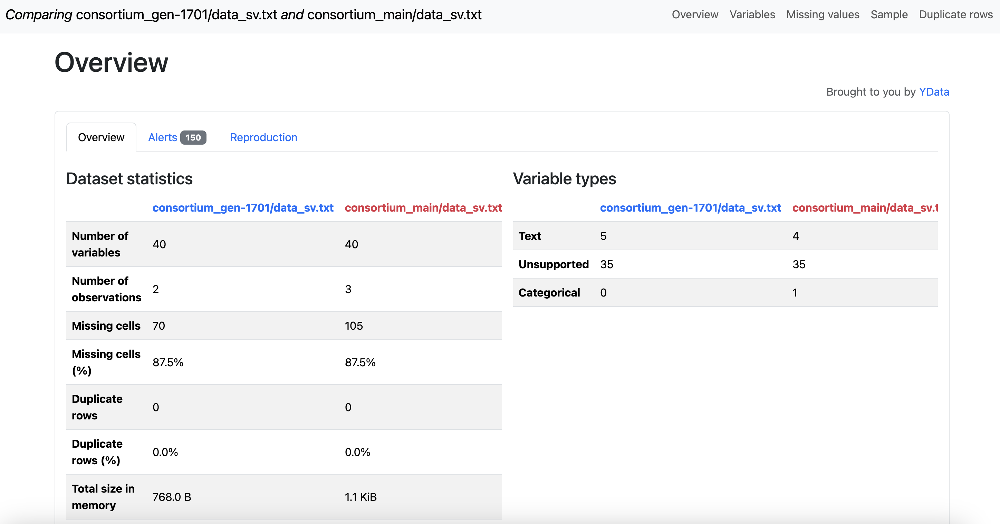

# Validation

## Comparisons between two Synapse entities

### Purpose

This helper script does comparisons for any
two data based synapse entities in Synapse whether it's different versions within the same entity or two different entities. We currently support the following entities:

- Synapse Tables
- Synapse Files (structured data files that can be read into pandas like csv, txt, tsv)

There will be two reports outputted. One using the `datacompy` package and one using the `y-dataprofiling` package.

### Setting up your environment

Dependencies:

- `python` >= 3.9, <=3.11

See `requirements.txt` for specific supported version(s) of these:

- `synapseclient`
- `pandas`
- [datacompy](https://github.com/capitalone/datacompy)
- [ydata-profiling](https://github.com/ydataai/ydata-profiling)
- `.synapseConfig` located in your local home directory
- READ/DOWNLOAD access to the synapse projects you want to compare entities from

You can use your favorite python environment manager like `pipenv`, `conda`, `uv` or just python virtual environment and install the dependencies from `requirements.txt`

There is also a `Dockerfile` available to build and install from.

### How to Run

**Script location:** `Genie_processing/utility_scripts/comparison_tools/compare_between_two_synapse_entities.py`

See the `read_args()` function for more details on each of the arguments and how to specify

You can also import in the `run_compare()` or `generate_comparison_reports()` function for custom code you want to use. The `generate_comparison_reports` function is especially useful if the default method of reading the data doesn't work and you need to use your own custom code to read in the data you want to compare.

**Here are some sample workflow run examples:**

To run a comparison between two different Synapse Tables on their latest versions
on the common columns (keys) id and cohort
```
python compare_between_two_synapse_entities.py
    --syn_id_1 syn1241249
    --syn_id_2 syn2423523
    --compare-type table
    --join-keys id cohort

```

To run a comparison between two different versions within a Synapse File
on the common columns (keys) id and cohort.
```
python compare_between_two_synapse_entities.py
    --syn_id_1 syn1241249.23
    --syn_id_2 syn1241249.35
    --version-name1 v1
    --version-name2 v2
    --entity-name BPC_compare
    --compare-type file
    --join-keys id cohort

```

You can use the version arguments to filter on the version comments within a Synapse entity
by specifying `version_name1`, `version_name2` and `--filter-on-version`
Here we filter on "v1" vs "v2" in the version comment of the same table for the comparison.
```
python compare_between_two_synapse_entities.py
    --syn_id_2 syn1241249
    --version-name1 v1
    --version-name2 v2
    --filter-on-version
    --compare-type table
    --join-keys id cohort

```

Save your output reports to a synapse entity by specifying
`--save-to-synapse` and a synapse entity synapse id for `--output-synid`
```
python compare_between_two_synapse_entities.py
    --syn_id_2 syn1241249
    --version-name1 v1
    --version-name2 v2
    --filter-on-version
    --compare-type table
    --join-keys id cohort
    --save-to-synapse
    --output-synid syn218418
```

### Outputs

- A file named `<entity_name>_<version1>_vs_<version2>_comparison_report.txt"`


- A file named `<entity_name>_<version1>_vs_<version2>_comparison_report_detailed.html"`

